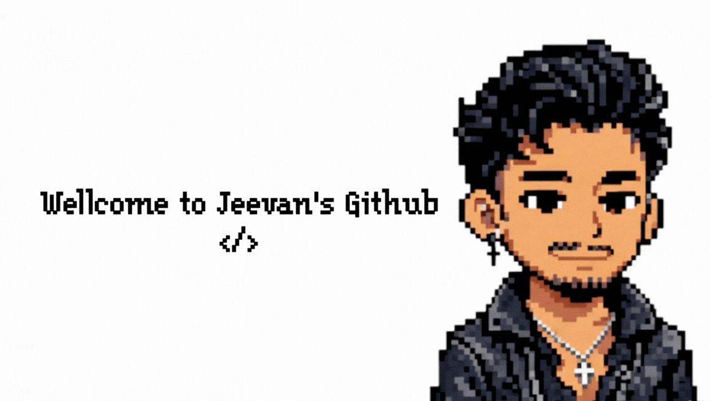

<!-- Banner -->

  

<h1 align="left">Hey👋 I'm JEEVAN JIJO</h1>

  Data Science Student  |  Designer  |  AI Enthusiast

---

## 👨‍💻 About Me

- 🎓 Pursuing Master's in Computer Science Data Science
- 💻 Passionate about Web Designing & AI
- 🚀 Currently learning Deep Learning

---

## 🔗 Connect With Me

  
  
  
  

---

## 🛠 Languages & Tools

  
   
  
   
  
   

---

## ⭐ Best Projects

### Data Science
Machine learning and data analysis projects.

### Artificial Intelligence
Deep learning experiments and AI models.

---

  

